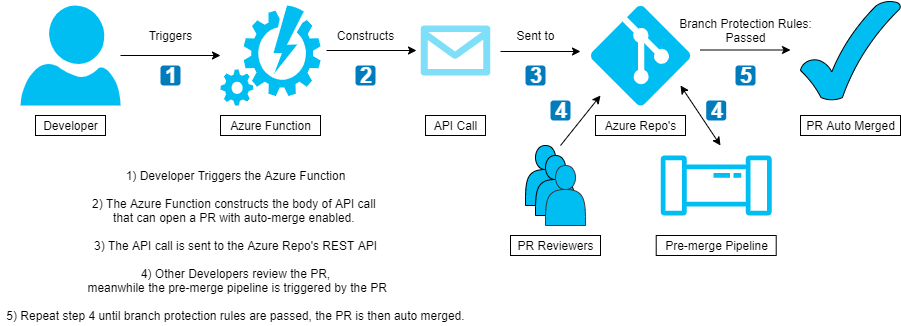

# Bespoke azure auto merge function design
This document details proposed bespoke solutions to the automatic merge requirement for the Azure DevOps PoC. 

## Simple Azure Function Design 

### Design walk through 
1) The Developer triggers an Azure function, providing it with the name of the source branch that they want to be merged onto the master branch.

2) The Azure function consumes the name of the source branch and uses it when constructing an API request. The API request will be used to open a new pull request for the user with auto-merge enabled.

3) The API request is sent to the Azure REST API. This opens the Pull request

4) Reviewers can then approve the pull request as normal.\
The branch protection rules will then trigger a pre-merge pipeline build.  

5) Once the PR has been approved and the pre-merge pipeline has build successfully the auto-merge is triggered

### Requirements
* In order to use the auto-merge capabilities of Azure repo's, branch protection rules must be in place.\

### Caveats
1) This design still requires the Developer to assign reviewers manually.
2) Branch protection rules dictate what is required before auto-merging can be done. 
3) There are costs associated with using Azure functions. 
4) If something goes wrong with the API request, the return code(s) might not be easily understood by the Developer.

### Potential future improvements
1) Add in additional variables that can be given to the Azure function to automatically request review from certain users. 

## Azure Service Hook & Function Design

### Design walk through 
1) The Developer opens a PR and tags reviewers as normal.

2) The newly opened PR triggers a pre-merge pipeline build

3) Reviewers approve the PR.

4) An Azure service hook is listening for both the successful build of the pre-merge pipeline and the approval of the PR

5) Once mergre requirements have been met the service hook sends a API call to the Azure Function

6) The Azure function deconstructs the API call, looking for the source branch, pull request ID and repository name.\
It uses this information to construct a new API call that will be used to update the PR's status to 'completed' (See merged)

7) The new API call is sent to the Azure API, and the PR is updated

8) The update to the PR status causes the PR to merge automatically. 

### Assumptions
* It is assumed that a single Service hook is able to listen for two separate events, and will only trigger when both events fire within a small time frame. 
* As an alternative to the above, it is possible to have a service hook listen for pull requests status changing, Assuming that a service hook can react to a PR becoming "mergeable"  we could this be the trigger for the azure function. 

### Caveats
1) There are costs associated with using Azure functions. 
2) If something goes wrong with the API request, the return code(s) might not be easily understood by the Developer.
3) Additional effort may be required to setup secure service hooks 

### Potential future improvements
1) Alter the service hook to look for pull requests which are "mergeable", and then trigger the azure function to merge them. This should remove the need to listen for two separate events, however it is unknown if it is possible to setup a service hook to listen specifically for "mergeable" PR's, see assumptions or details. 

## References

* [Auto-merge using azure pull requests](https://docs.microsoft.com/en-us/azure/devops/repos/git/pull-requests?view=azure-devops#complete-automatically)
* [Azure Repositories branch protection rules](https://docs.microsoft.com/en-us/azure/devops/repos/git/branch-policies?view=azure-devops)
* [Creating a pull request using the Azure REST API](https://docs.microsoft.com/en-us/rest/api/azure/devops/git/pull%20requests/create?view=azure-devops-rest-5.1)
* [Using service hooks to create custom branch policies](https://docs.microsoft.com/en-us/azure/devops/repos/git/create-pr-status-server-with-azure-functions?view=azure-devops)
* [Pull Request Status - Get. (API reference)](https://docs.microsoft.com/en-us/rest/api/azure/devops/git/pull%20request%20statuses/get?view=azure-devops-rest-5.1)